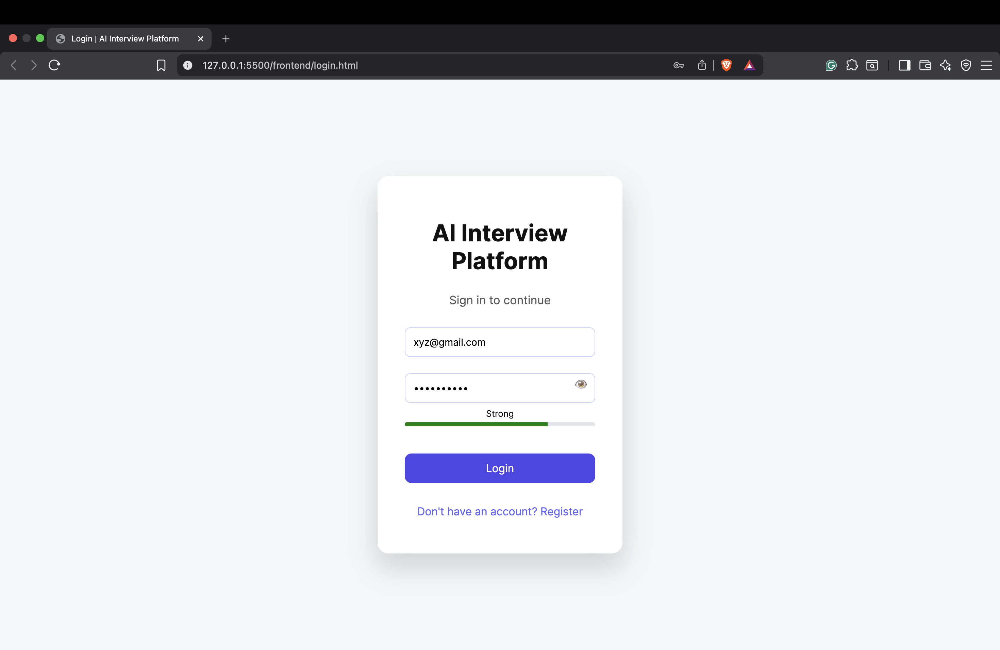
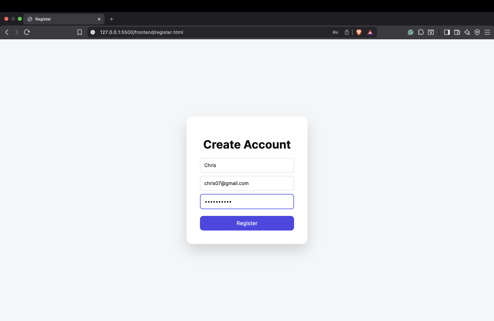
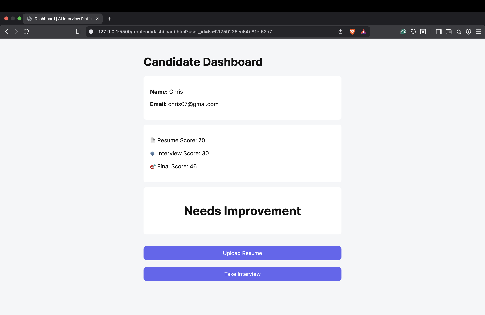
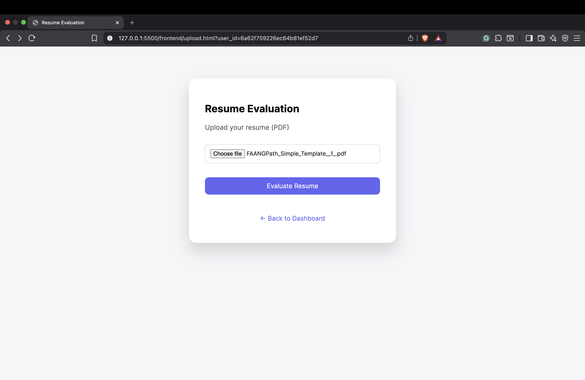
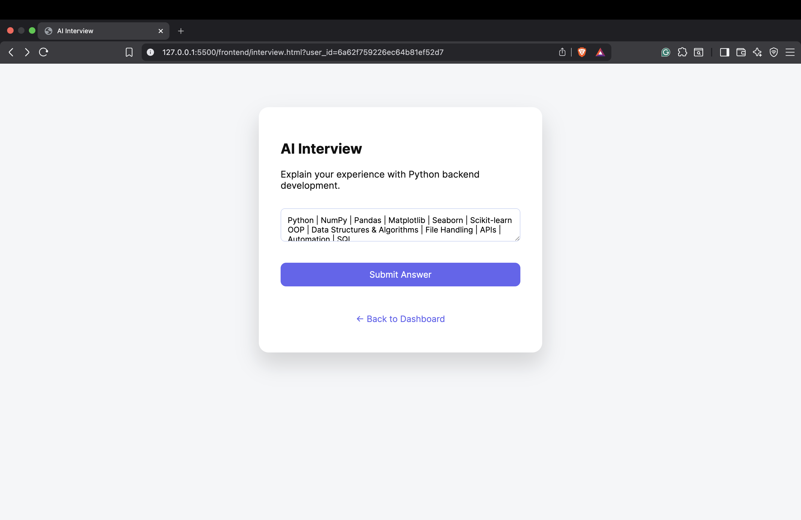

#  AI Interview Platform

An AI-powered interview preparation platform designed to help users improve their interview skills through resume analysis, AI-generated interview questions, and intelligent feedback.

##  Overview
NOTE: THIS IS JUST THE PROTOTYPE.....

The AI Interview Platform is a full-stack web application that assists students and job seekers in preparing for technical interviews. Users can upload their resumes, receive AI-powered analysis, and practice interview questions tailored to their skills and experience.

This project was developed as part of my college project to explore the integration of Artificial Intelligence with modern web development.

---

##  Features

*  User Registration and Login
*  Resume Upload and Analysis
*  AI-Based Interview Question Generation
*  Intelligent Interview Assistance
*  User Dashboard
*  Responsive Frontend
*  Secure Authentication

---

##  Tech Stack

### Frontend

* HTML
* CSS
* JavaScript

### Backend

* Python
* FastAPI

### Database

* mongoDB

### AI & Tools

* OpenAI API
* Git
* GitHub

---

##  Project Structure

```text
AI-Interview-Platform/
│
├── backend/
│   ├── auth.py
│   ├── database.py
│   ├── db.py
│   ├── interview_ai.py
│   ├── main.py
│   ├── models.py
│   ├── resume_ai.py
│   ├── schemas.py
│   └── requirements.txt
│
├── frontend/
│   ├── dashboard.html
│   ├── index.html
│   ├── interview.html
│   ├── login.html
│   ├── register.html
│   ├── script.js
│   ├── style.css
│   └── upload.html
│
├── README.md
└── .gitignore
```

---

##  Getting Started

### 1. Clone the Repository

```bash
git clone https://github.com/harshitkumarmenaria/AI-interview-platform.git
```

### 2. Navigate to the Project

```bash
cd AI-interview-platform
```

### 3. Install Dependencies

```bash
cd backend
pip install -r requirements.txt
```

### 4. Start the Backend

```bash
uvicorn main:app --reload
```

### 5. Open the Frontend

Open the HTML files in the `frontend` folder using your browser or a local development server.

---

##  Screenshots

## 📸 Screenshots

### Login Page


---

### Register Page


---

### Dashboard


---

### Resume Upload


---

### AI Interview


---

##  Future Improvements

* AI mock interview with voice support
* Real-time interview scoring
* Interview history and analytics
* Resume improvement suggestions
* Cloud database integration
* Admin dashboard

---

##  Author

**Harshit Kumar Menaria**

Computer Science Engineering Student

Interested in Artificial Intelligence, Full-Stack Development, and Software Engineering.

---

##  Support

If you found this project useful, consider giving it a **Star** on GitHub.
